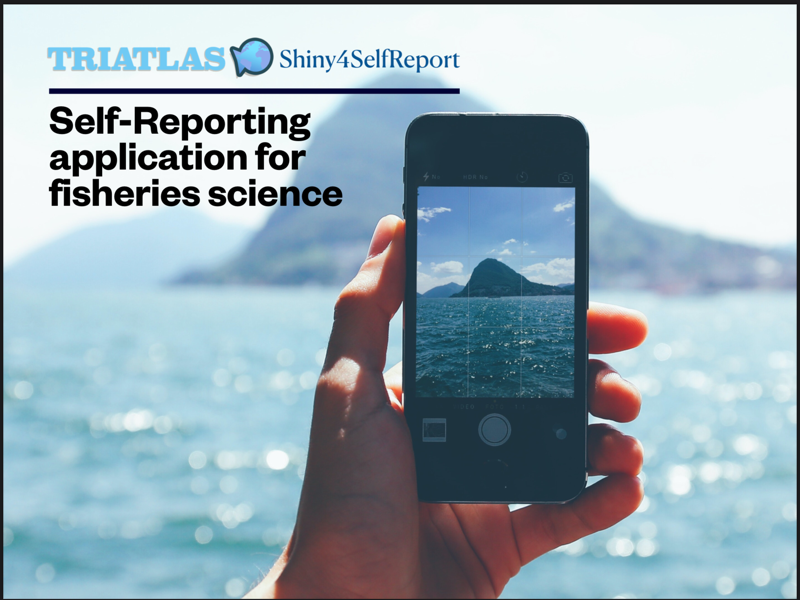

# Shiny4SelfReport

Self-reporting applications are considered a promising solution for fisheries data monitoring. However, they are still failing in providing accurate information and engaging users. We introduce the Shiny4SelfReport, an application for self-reporting data in fisheries that aims to address these shortcomings. Instead of using expensive proprietary software, we demonstrate how common and affordable technologies can be used to fill gaps in fisheries management of developing nations. The tool, developed in R, works by gathering fishers’ inputs and storing them in the cloud. It was designed to be simple and adaptable. Our application improves the data assembly on small-scale fisheries, provides fishers’ engagement and data accuracy, and may integrate fisheries' knowledge worldwide while filling the gaps on data-poor fisheries. The app is available at http://triatlas.shinyapps.io/Shiny4SelfReport under a General Public License (GPLv3).

